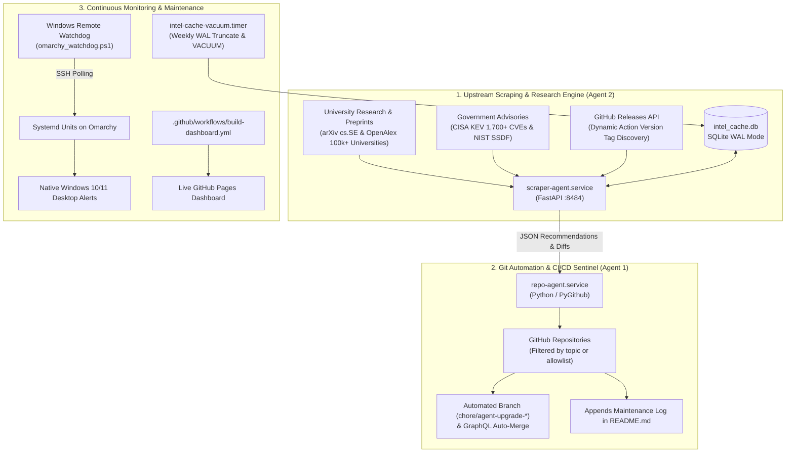

# ⚡ Omarchy CI Orchestrator

> **Autonomous Dual-Daemon CI/CD Intelligence, Automated Dependency Remediation & Live Fleet Governance Engine for Omarchy (Arch Linux) & GitHub Enterprise.**

[](https://freefades2black.github.io/omarchy-ci-orchestrator/)
[](https://archlinux.org)
[](https://sqlite.org)
[](https://www.cisa.gov/known-exploited-vulnerabilities-catalog)

---

## 🏛️ System Architecture

The orchestrator partitions autonomous repository governance into two decoupled, headless `systemd` user daemons backed by persistent SQLite caching and monitored over local IPC:



---

## 📁 Repository Structure

```text
omarchy-ci-orchestrator/
├── .github/
│   └── workflows/
│       ├── build-dashboard.yml     # Hourly telemetry harvester & Pages deployer
│       └── ci.yml                  # Syntax, linting, and unit validation gate
├── docs/                           # Live GitHub Pages Dashboard
│   ├── index.html                  # Responsive dark-theme dashboard UI
│   └── telemetry.json              # Aggregated fleet telemetry feed
├── systemd/
│   ├── scraper-agent.service       # Academic & Government Intelligence Scraper
│   ├── repo-agent.service          # Repository Watchdog & Git Committer
│   ├── intel-cache-vacuum.service  # SQLite WAL checkpoint & vacuum runner
│   ├── intel-cache-vacuum.timer    # Weekly maintenance schedule (Sundays 03:00)
│   └── notify-failure@.service     # Instantiated desktop failure alert template
├── scripts/
│   ├── install.sh                  # 1-touch idempotent Arch Linux bootstrap
│   ├── vacuum_cache_db.sh          # WAL flush & vacuum script
│   ├── systemd_notify_failure.sh   # Wayland/X11 desktop notification dispatcher
│   └── omarchy_watchdog.ps1        # Windows client remote watchdog
├── repo_agent/
│   ├── config.json.example         # Scan interval & topic filter template
│   ├── requirements.txt            # PyGithub, pydantic, requests
│   └── main.py                     # GitHub API inspector, auto-merger, README logger
├── scraper_agent/
│   ├── requirements.txt            # FastAPI, uvicorn, feedparser, aiohttp
│   ├── db.py                       # WAL-mode persistent SQLite interface
│   └── main.py                     # Dynamic collectors (CISA, arXiv, GitHub Releases)
└── shared/
    ├── __init__.py
    └── ipc_schema.py               # Pydantic schemas for inter-agent IPC
```

---

## 🚀 1-Touch Bootstrap on Omarchy (Arch Linux)

Clone and run the idempotent installer directly on your Omarchy host:

```bash
git clone https://github.com/FreeFades2Black/omarchy-ci-orchestrator.git ~/omarchy-ci-orchestrator
cd ~/omarchy-ci-orchestrator
bash scripts/install.sh
```

### What `install.sh` Performs:
1. Installs pacman dependencies (`python`, `pip`, `sqlite`, `libnotify`, `curl`, `jq`, `github-cli`).
2. Provisions a dedicated Python virtualenv in `~/agents/venv`.
3. Sets up `~/agents/cache` with restricted `0700` permissions.
4. Registers and starts all systemd user units:
   - `scraper-agent.service` (port `8484`)
   - `repo-agent.service` (continuous loop)
   - `intel-cache-vacuum.timer` (weekly cleanup)
5. Enables persistent user lingering (`loginctl enable-linger $USER`) so daemons survive SSH and console disconnects.

---

## 🔍 Verification & Operations

### 1. Check Service Status
```bash
systemctl --user status scraper-agent.service repo-agent.service --no-pager
```

### 2. Live Health Endpoint
```bash
curl -s http://127.0.0.1:8484/health | jq .
```
```json
{
  "status": "healthy",
  "service": "scraper-agent",
  "version": "2.1.0 (sqlite-backed)",
  "live_sources": {
    "cisa_kev_cves": 1731,
    "academic_citations": 8,
    "cached_action_tags": 2,
    "last_synced": "2026-10-01T20:26:12Z"
  }
}
```

### 3. Inspect Live SQLite Cache (`intel_cache.db`)
```bash
sqlite3 -box ~/agents/cache/intel_cache.db \
  "SELECT repo, version, expires_at FROM action_versions ORDER BY expires_at DESC LIMIT 5;"
```

### 4. Follow Watchdog Audit Logs
```bash
journalctl --user-unit=repo-agent.service -f
```

---

## 🖥️ Windows Remote Watchdog (`omarchy_watchdog.ps1`)

Run [`scripts/omarchy_watchdog.ps1`](scripts/omarchy_watchdog.ps1) on your Windows machine to pull systemd unit states over SSH and display native desktop toast notifications and audio chimes whenever an Omarchy unit fails:

```powershell
# Run hidden in the background
Start-Process powershell.exe -ArgumentList "-WindowStyle Hidden -ExecutionPolicy Bypass -File C:\Users\FreeF\agents\omarchy_watchdog.ps1"
```

To run automatically at every Windows logon, launch via `OmarchyWatchdog.vbs` in your user Startup folder (`shell:startup`).

---

## 📊 Live Telemetry Dashboard (GitHub Pages)

The repository compiles fleet metrics hourly via [`.github/workflows/build-dashboard.yml`](.github/workflows/build-dashboard.yml):
* **Live Site**: **[https://freefades2black.github.io/omarchy-ci-orchestrator/](https://freefades2black.github.io/omarchy-ci-orchestrator/)**
* Displays all active monitored repositories, recent automated Pull Requests with auto-merge status, and intelligence engine posture.

## Automated CI Maintenance Log
<!-- START_AGENT_MAINTENANCE_LOG -->
#### Maintenance Run: `2026-10-04 21:48:16 UTC`
- `.github/workflows/build-dashboard.yml`: Upgrade actions/checkout from v4 to v7 for security & performance. [Research: RCSB PDB AI Help Desk: retrieval-augmented generation for protein structure deposition support (OpenAlex / Global University Research)] [NIST SP 800-218 PW.4]
- `.github/workflows/build-dashboard.yml`: Upgrade actions/configure-pages from v5 to v6 for security & performance. [Research: RCSB PDB AI Help Desk: retrieval-augmented generation for protein structure deposition support (OpenAlex / Global University Research)] [NIST SP 800-218 PW.4]
- `.github/workflows/build-dashboard.yml`: Upgrade actions/upload-pages-artifact from v3 to v5 for security & performance. [Research: RCSB PDB AI Help Desk: retrieval-augmented generation for protein structure deposition support (OpenAlex / Global University Research)] [NIST SP 800-218 PW.4]
- `.github/workflows/build-dashboard.yml`: Upgrade actions/deploy-pages from v4 to v5 for security & performance. [Research: RCSB PDB AI Help Desk: retrieval-augmented generation for protein structure deposition support (OpenAlex / Global University Research)] [NIST SP 800-218 PW.4]
- `.github/workflows/build-dashboard.yml`: Enforce timeout-minutes: 10 to kill hung processes and prevent runaway billing (CISA & FinOps).
- `.github/workflows/ci.yml`: Upgrade actions/checkout from v4 to v7 for security & performance. [Research: RCSB PDB AI Help Desk: retrieval-augmented generation for protein structure deposition support (OpenAlex / Global University Research)] [NIST SP 800-218 PW.4]
- `.github/workflows/ci.yml`: Upgrade actions/setup-python from v5 to v7 for security & performance. [Research: RCSB PDB AI Help Desk: retrieval-augmented generation for protein structure deposition support (OpenAlex / Global University Research)] [NIST SP 800-218 PW.4]
- `.github/workflows/ci.yml`: Enforce timeout-minutes: 10 to kill hung processes and prevent runaway billing (CISA & FinOps).

<!-- END_AGENT_MAINTENANCE_LOG -->
